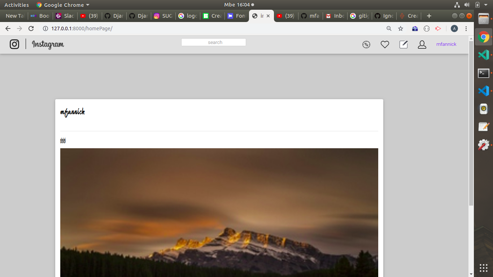

# instagram
  This is a python application for user posting displaying images.
  it includes search and user profile.

  ## setUp instruction

   | Required                                  | Description                                                       | How to run                            |
|-------------------------------------------|-------------------------------------------------------------------|---------------------------------------|
| A user visit the website signs up or logs in       | S/he can see posted images,search other user using their username                                 | The project is run using the browser |
                 

   ### Technologies used

     -Python
     -Django 
   ### BDD
   

   ### Contact information
    
    Email:mfannick1@gmail.com

   ### MIT License and Copyright information
   
  [MIT](https://choosealicense.com/licenses/mit/)
  Copyright &copy;2019 Annick-Francine-M